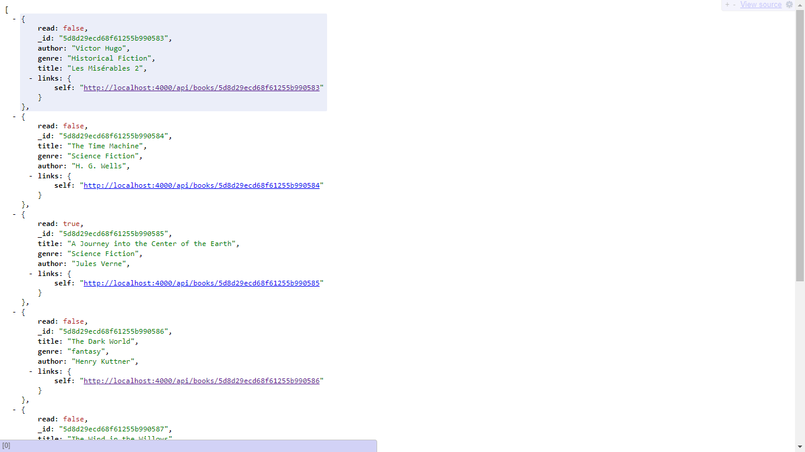
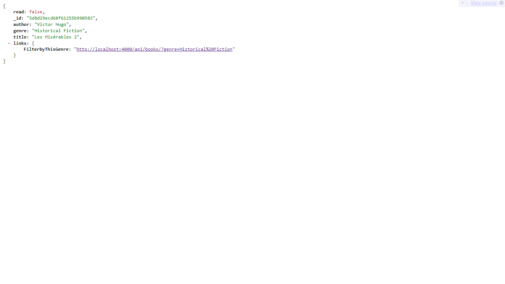

# Book NodeJS API

An Api built with nodejs where you can perform CRUD operations.

## What I learnt

* Used Express to Created a Rest API to
  * POST a new Book
  * GET A single Book
  * PUT ie update a Book
  * DELETE a Book
  * PATCH a Book (update a detail about a Book).
  * Query Books based in genre

* Each API response was accompanied with the appropriate status code and json response.

* Created a Mongodb database to store a collection of books
* Created a mongodb schema to ensure the database recieve correct data

* Implemented HATEOAS, to allow easy Navigation of the API.

## Screenshots

### GET Request to all books

### GET Request for single book

## Side Info

* This project was used as a backend for my ng-booklist Angular project.

* Used eslint for the first time to ensure am writing code by following the best practices( by airbnb).